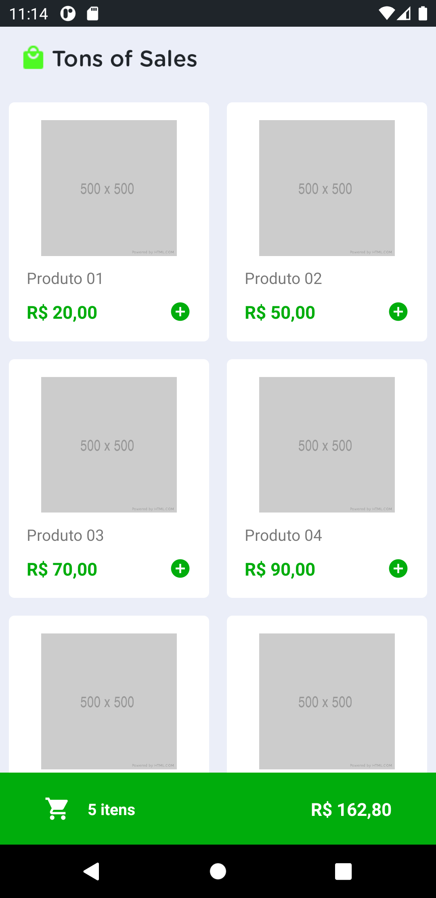
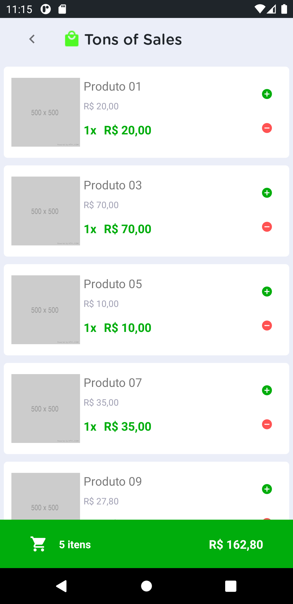

<h1 align="center">
  
</h1>

<p align="center">
  

  

  <a href="https://github.com/Jumori/tons-of-sales/commits/master">
    
  </a>

</p>

Tabela de conteúdos
=================
<!--ts-->
   * [Sobre o projeto](#-sobre-o-projeto)
   * [Como executar o projeto](#-como-executar-o-projeto)
     * [Pré-requisitos](#pré-requisitos)
     * [Rodando a aplicação](#rodando-a-aplicação-mobile)
   * [Tecnologias](#-tecnologias)
   * [Autora](#-autora)
   * [Licença](#user-content--licença)
<!--te-->

## 💻 Sobre o projeto

Tons of Sales - Aplicação mobile para a sua loja!

Comercialize seus produtos de forma fácil e rápida através do aplicativo Tons of Sales.

<table>
  <tr>
    <td>
      
    </td>
    <td>
      
    </td>
  </tr>
</table>

## 🚀 Como executar o projeto

Para esse projeto, estaremos utilizando um [Gist](https://gist.github.com/Jumori/c3451ba65a5027470122a81354718193) para servir os dados da nossa aplicação.

### Pré-requisitos

Antes de começar, você vai precisar ter instalado em sua máquina as seguintes ferramentas:
[Git](https://git-scm.com), [Node.js](https://nodejs.org/en/), [Yarn](https://yarnpkg.com/)


### Rodando a aplicação mobile

```bash

# Clone este repositório
$ git clone git@github.com:Jumori/tons-of-sales.git

# Acesse a pasta do projeto no seu terminal/cmd
$ cd tons-of-sales

# Instale as dependências
$ yarn install

```

1. Com Expo CLI
```bash

# Instale o expo-cli
$ yarn global add expo-cli

# Inicie o ambiente de desenvolvimento
$ yarn start # ou expo start

```

2. React Native CLI
```bash

# Inicie o Metro, bundler JavaScript do React Native
$ yarn react-native start

# Inicie a aplicação no ambiente de desenvolvimento
$ yarn react-native run-android

# Se o seu ambiente estiver configurado corretamente, você verá a aplicação rodando no seu emulador Android

```

## 🛠 Tecnologias

As seguintes ferramentas foram usadas na construção do projeto:

#### **Mobile**  ([React Native](https://reactnative.dev/)  +  [TypeScript](https://www.typescriptlang.org/))

-   **[Axios](https://github.com/axios/axios)**
-   **[Styled Components](https://styled-components.com/)**
-   **[Jest](https://jestjs.io/)**

> Veja o arquivo  [package.json](https://github.com/Jumori/tons-of-sales/blob/master/package.json)


## 🦸 Autora

<a href="https://github.com/Jumori">
 
 <br />
 <sub><b>Juliana Morikoshi</b></sub></a>
 <br />

[](https://www.linkedin.com/in/julianamorikoshi/)
[](mailto:julianamorikoshi@gmail.com)

---

## 📝 Licença

Este projeto esta sob a licença [MIT](./LICENSE).

Feito com ❤️ por Juliana Morikoshi 👋 [Entre em contato!](https://www.linkedin.com/in/julianamorikoshi/)
